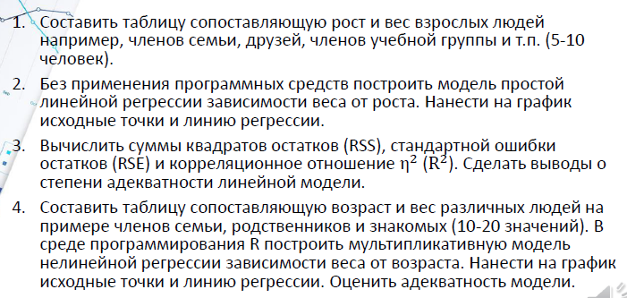

# Лабораторная работа 6 (Связана с презой 18)

## Текстовое описание

1. Составить таблицу сопоставляющую рост и вес взрослых людей например, членов семьи, друзей, членов учебной группы и т.п. (5-10 человек).
2. Без применения программных средств построить модель простой линейной регрессии зависимости веса от роста. Нанести на график исходные точки и линию регрессии.
3. Вычислить суммы квадратов остатков (RSS), стандартной ошибки остатков (RЅE) и корреляционное отношение nu^2 (R^2). Сделать выводы о степени адекватности линейной модели.
4. Составить таблицу сопоставляющую возраст и вес различных людей на примере членов семьи, родственников и знакомых (10-20 значений). В среде программирования R построить мультипликативную модель нелинейной регрессии зависимости веса от возраста. Нанести на график исходные точки и линию регрессии. Оценить адекватность модели.

### Вместо членов семьи и друзей:
- X принадлежит N(0, 1)
- Yj = 15Xj - 17 + eps
- eps принадлежит N(0, 1)
- n = 500

## Выводы

### Выводы по линейной модели

* Данные были сгенерированы на основе линейной зависимости с добавлением случайного шума.
* Поэтому ожидается, что коэффициент детерминации R² будет высоким (близким к 1).
* Высокий R² свидетельствует о хорошем соответствии модели данным.
* Низкое значение RSE (среднеквадратичной ошибки остатков) относительно масштаба данных также подтверждает адекватность и точность линейной модели.

---

### Выводы по мультипликативной модели

* Исходная зависимость между переменными является линейной, поэтому мультипликативная модель даёт меньший R², чем линейная.
